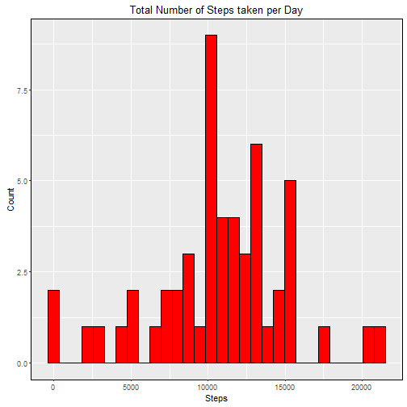
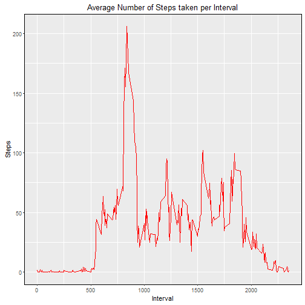
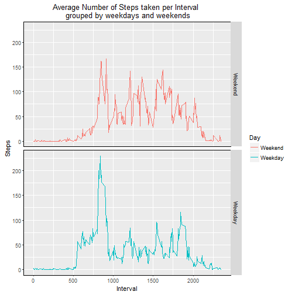

#**Reproducible Research Week 2 Assignment**
##Paschalis Lagias
  
###**Set options.**
Set Global r code chunk options:

```r
    library(knitr)
    opts_chunk$set(echo = TRUE)
```
  
###**Download and read the data.**
  
Check if a data folder exists in the working directory.  
If not, create a folder, download the data zip file, save it and unzip it.  
"AMD" stands for Activity Monitoring Data.  

```r
  url <- "https://d396qusza40orc.cloudfront.net/repdata%2Fdata%2Factivity.zip"
  if(!file.exists("./AMD")){
        dir.create("./AMD")
        download.file(url, destfile = "./AMD/amd.zip")
        unzip(zipfile = "./AMD/amd.zip", exdir = "./AMD")
}
```
  
  
Print data folder contents to see the name of the unzipped data file.

```r
    print(dir("./AMD"))
```

```
## [1] "activity.csv" "amd.zip"
```
  
  
Read the data file and store it in a data frame:

```r
    amd <- read.csv("./AMD/activity.csv", na.strings = "NA")
```
  
###**Mean total number of steps taken per day.**  
  
Subset the data frame to remove missing values ("NAs").  
Calculate a new data frame with the sums of steps per day.  

```r
  tidy_amd <- subset(amd, !amd$steps == "NA")
  StepsPerDay <- aggregate(tidy_amd[c("steps")], list(day = tidy_amd$date), sum)
```
  
  
Create histogram of the total number of steps taken per day.

```r
library(ggplot2)
ggplot(data = StepsPerDay, aes(StepsPerDay$steps)) +
  geom_histogram(col = "black", fill = "red") +
  labs(title = "Total Number of Steps taken per Day", x = "Steps", y = "Count") + 
  theme(panel.border = element_rect(colour = "black", fill = NA))
```

```
## `stat_bin()` using `bins = 30`. Pick better value with `binwidth`.
```


  
    
Calculate the mean and the median of the total   
number of steps taken per day.

```r
MeanStepsPerDay <- mean(StepsPerDay$steps)
MedianStepsPerDay <- median(StepsPerDay$steps)
```
The *mean* number of steps taken per day is **1.0766189 &times; 10<sup>4</sup>**.  
The *median* number of steps taken per day is **10765**.  

###**Average daily activity pattern.**  
  
Calculate a new data frame with  
the steps per interval averaged across all days.  

```r
StepsPerInt <- aggregate(tidy_amd[c("steps")], list(int = tidy_amd$interval), mean)
```


Make a time series plot of the 5-minute interval  
and the average number of steps taken.

```r
ggplot(data = StepsPerInt, aes(int, steps)) +
  geom_line(col = "red", lwd = 0.4) +
  labs(title = "Average Number of Steps taken per Interval", x = "Interval", y = "Steps") + 
  theme(panel.border = element_rect(colour = "black", fill = NA))
```




Find the interval with the maximum average number of steps.  

```r
max <- subset(StepsPerInt, StepsPerInt$steps == max(StepsPerInt$steps))
```
Interval **835** is the interval with the maximum  
average number of steps taken **(206.1698113 steps)**.

###**Imputing missing values.** 
  
Calculate the total number of rows with NAs.

```r
RowsWithNA <- nrow(amd[amd$steps == "NA", ])
```


The total number of rows with NAs is **2304**.  

NA values are replaced by the mean step number  
for every specific interval across days.  
Modifications are stored in a new data frame.


```r
amdFull <- amd
for(i in 1:nrow(amdFull)){
    if(is.na(amdFull[i, 1])){
    amdFull[i, 1] <- subset(StepsPerInt$steps, StepsPerInt$int == amdFull[i, 3])
    }
}
```

Calculate and store total steps per day with NAs replaced  
in a new data frame.

```r
  StepsPerDayNoNA <- aggregate(amdFull[c("steps")], list(day = amdFull$date), sum)
```
  
  
Create histogram of the total number of steps taken per day  
after replacing NAs.

```r
ggplot(data = StepsPerDayNoNA, aes(StepsPerDayNoNA$steps)) +
  geom_histogram(col = "black", fill = "red") +
  labs(title = "Total Number of Steps taken per Day \n after replacing NAs", x = "Steps", y = "Count") + 
  theme(panel.border = element_rect(colour = "black", fill = NA))
```

```
## `stat_bin()` using `bins = 30`. Pick better value with `binwidth`.
```


  
    
Calculate the mean and the median of the total   
number of steps taken per day after replacing NAs.

```r
MeanStepsPerDayNoNa <- mean(StepsPerDayNoNA$steps)
MedianStepsPerDayNoNa <- median(StepsPerDayNoNA$steps)
```
The *mean* number of steps taken per day is **1.0766189 &times; 10<sup>4</sup>**.  

The *median* number of steps taken per day is **1.0766189 &times; 10<sup>4</sup>**.  

**Check the new calculated values against the mean and median**  
**before NA replacement.**

```r
meandiff <- MeanStepsPerDayNoNa - MeanStepsPerDay
mediandiff <- MedianStepsPerDayNoNa - MedianStepsPerDay
```
The difference between the two calculated means is **0**.  
The difference between the two calculated medians is **1.1886792**.  
  
We see that the averages have not changed.  
However, the median has changed as we now have more  
values for steps across the days.

###**Differences on activity patterns between weekdays and weekends.**


```r
amdFull$date <- as.Date(amdFull$date)
wkdays <- c("Monday", "Tuesday", "Wednesday", "Thursday", "Friday")
amdFull$Day <- factor(weekdays(amdFull$date) %in% wkdays, levels = c(FALSE, TRUE), labels = c("Weekend", "Weekday"))
```


Calculate a new data frame with  
the steps per interval averaged across all days.  
NAs have been replaced.

```r
StepsPerIntNoNa <- aggregate(amdFull[c("steps")], list(int = amdFull$interval, Day = amdFull$Day), mean)
```

Make a two-panel time series plot of the 5-minute interval  
and the average number of steps taken for weekdays and weekends.

```r
ggplot(data = StepsPerIntNoNa, aes(x = int, y = steps)) +
  geom_line(aes(color = Day)) +
  facet_grid(Day ~ .) + 
  labs(title = "Average Number of Steps taken per Interval \n grouped by weekdays and weekends", x = "Interval", y = "Steps") +
  theme(panel.border = element_rect(colour = "black", fill = NA))
```


